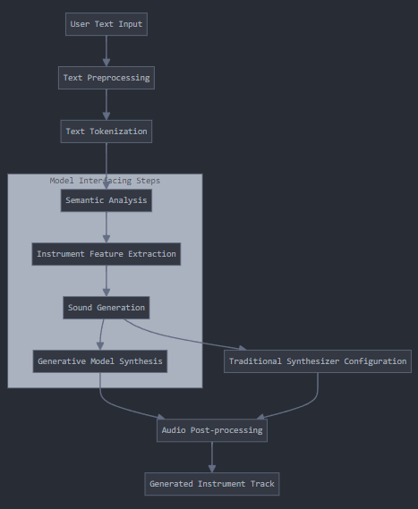

# Generative Audio Workstation

## Table of Contents
- Project Overview
- Features
- TechStack
- Architecture
- Development Considerations

## Project Overview
    This project aims to develop a web-hosted, lightweight digital audio workstation integrated with generative audio capabilities and processing.

## Features 
### MVP features
1. Audio Generation
    Text-to-Instrument track generation (description of desired sound is interpreted and generated as corresponding audio)
    Style transfer for existing audio tracks
    AI-assisted melody generation

2. Audio Recording and Editing
    Multi-track recording capabilities
    Basic audio editing tools (cut, copy, paste, fade, etc.)
    Real-time effects processing
    Volume and pan controls for individual tracks
    Playback

3. Multi-track view and simple user interface

### Other Features
4. Virtual Instruments / MIDI capabilities
5. Mixing and Mastering functionalities
6. Project management 

## TechStack
### Frontend
- React

### Backend
- Django REST / Python 

### Database
- PostgreSQL (?)

### Model Integration
- Diffusion Model (?)

### Audio Processing
- Python libraries (e.g., Librosa)
- Web Audio API

## Architecture
- Text-to-Track pipeline

## Development Considerations
- Configure CORS (Cross-Origin Resource Sharing) in Django to allow requests from React
- JWT for authentication
- Plan API endpoints (and potentially versioning)
- WebSockets/Django Channels
- File Uploads/Storage
- Performance optimizations (lazy loading in React and caching in Django)
- Error Handling/Testing
- React's Web Audio API for client-side audio processing
